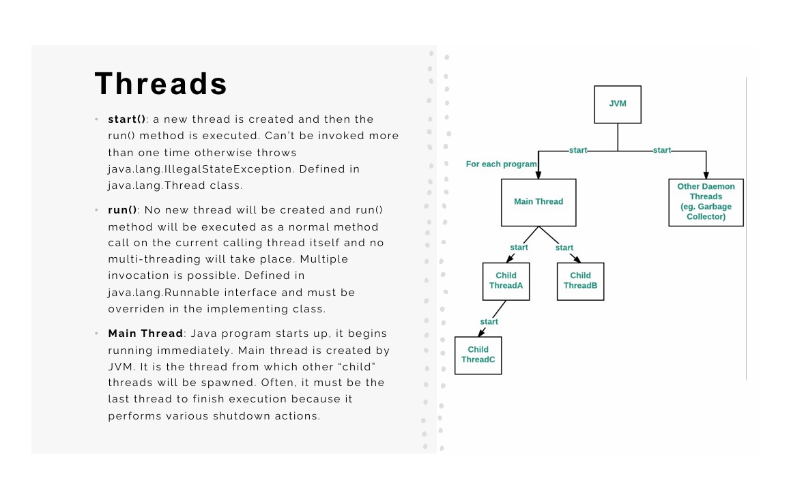

# Java-Threads
## 1. difference between threads and process
### 1.1 Process:-
    * An executing program is called a process. Process provides environment for execution of threads
    * Every process has its separate address space.
    * Processs-based multitasking allows a computer to run two or more than two programs concurrently.
    * Communication and Context-Switching between two processes is expensive and limited.
    * Process is called heavyweight task.
### 1.2 Thread:-
    *Thread is a small part of process.
    * All the threads of process share the same address space cooperatively as that of a process.
    * Thread-based mutltitasking allows a single program to run two ore more threads concurrently.
    * Communication and context-switching between two threads is less expensive as compared to process.
    * Thread are also called lightweight task.
## 2. Thread Life Cycle:-

### 2.1 New State:- 
    * When you create a thread object using new Thread() or implementing Runnable, the thread starts in New state. At this point:
        * No system resuorces have been allocated
        * The thread hasn't started the execution.
        * Only start() or stop() methods can be called.
        * Calling other methods throws IllegalThreadStateException.
### 2.2 Runnable State:-
    * After calling start(), the thread moves to Runnable state. This state means:
        * The thread is ready to execute but may not be currently running.
        * It is waiting for CPU time allocation from the thread scheduler.
        * Multiple runnable threads share CPU time in small slices.
        * The thread scheduler decides which runnable thread gets CPU based on priority.
### 2.3 Running State(Active State):-
    * When the thread scheduler assigns CPU time to a runnable thread, it enters Running state:
        * The thread is actively executing on the CPU.
        * Instruction in the run() method are executing sequentially.
        * After the time slice ends, it returns to Runnable State.
        * This is sub-state of the broader "Active State".
### 2.4 Blocked state:-
    * A thread enters Blocked state when:
        * It is waiting to acquire a monitor lock held by another thread.
        * Trying to enter a synchronized block/method already occupied.
        * Waiting to reacquire a lock after calling Object.wait().
        * The only transition from Blocked is back to Runnable once the lock is acquired.
### 2.5 Waiting State:-
    * A thread moves to Waiting state when:
        * Calling Object.wait() without timeout
        * Calling Thread.join() without timeout
        * Calling LockSupport.park()
        * The thread waits indefinitely until notified by another thread.
### 2.6 Timed_Waiting State:-
    * This state occurs when a thread calls methods with timeout parameters:
        * Thread.sleep(milliseconds)
        * Object.wait(timeout).
        * Thread.join(timeOut).
        * LockSupport.parkNanos() or LockSupport.parkUntil().
        * The thread automaticalli returns to Runnable When timeout expires or notification is recieved.
### 2.7 Terminated/Dead state:-
    * A thread reaches Terminated state when:
        * The run() method completes execution.
        * An uncaught exception terminates the thread.
        * The thread is explicitly stopped (depcreated).
        * Once terminated, a thread cannot be restarted.

## 3. Creating thread using Thread class vs Runnable interface
### 3.1 Thread class
    * When we extend Thread class, we can’t extend any other class even we require.
    *  When we extend Thread class, each of our thread creates unique object associate with it. 
### 3.2 Runnable interface
    * When we implement Runnable, we can save a space for our class to extend any other class in future or now.
    * When we implements Runnable, it shares the same object to multiple threads.
Ex:-public class Threads_By_T {
    public static void main(String[] args) throws InterruptedException {
        MyThread mt = new MyThread();
        mt.start();
        // Sleep in main thread to let mt run first
        Thread.sleep(1000);
       
        Thread t = new Thread(new MyrThread());
        // Sleep in main thread to let t run before the program
        t.start();
        t.sleep(1000);
        }
    }
    class MyThread extends Thread{
        @Override
        public void run(){
            System.out.println("Thread");
            for (int i = 0; i < 10 ; i++) {
                
                System.out.println(i+" "+Thread.currentThread().getName());
            }
        }
    }
    class MyrThread implements Runnable {

        @Override
        public void run() {
            System.out.println("Runnable");
            for (int i = 0; i < 10; i++) {
                System.out.println(i+" "+Thread.currentThread().getName());
            }
        }  
    }  
## 4. Daemon Thread:-
    * DT in java is a low priority thread that runs in the background to perform tasks such as garbage collection. Daemon thread in java is a service provider thread that provides services to the user thread. Its life depends on the mercy of user threads i.e when all the user threads die. JVM terminates this thread automatically. Eg:-Garbage collection in java(gc), finalizer, etc...

    * They can not prevent the jvm from exiting, when all the user threads finish execution Jvm terminates itself, By default the main thread is always non-daemon but for all the remaining threads created by daemon thread inherit deamon in nature from parent to child.
    
    * Methods:- setDaemon(boolean status), isDaemon() etc...
Ex:-public class DaemonThread {
    public static void main(String[] args) {
        // Daemon thread run in backgorund till all the user threads finish execution after jvm will automatically terminates the daemon Thread
        Thread deamon = new Thread(() -> {
            while (true) { 
                try {
                    System.out.println("Daemon Thread is running");
                    Thread.sleep(500);
                } catch (InterruptedException ex) {
                    ex.printStackTrace();
                }
            }
        });
        deamon.setDaemon(true);
        deamon.start();
        System.out.println("Main thread is running");
        try {
            Thread.sleep(3000);
        } catch (InterruptedException ex) {
            ex.printStackTrace();
        }
        System.out.println("Main thread is running");
        
    }
}
## 5. Concurrency :-
    * Concurrency focuses on managing multiple tasks at once, creating the illusion of simultaneous execution even on a single-core processor.
    * It is achieved through techniques like context switching where a single CPU rapidly switches between different tasks, making progress on each without necessarily completing one before starting another.
    * Java's multithreading capabilities, using the Thread class or Runnable interface, facilitate concurrency. Threads can be managed and synchronized using constructs like synchronized blocks/methods, volatile keywords, and java.util.concurrent package utilities (e.g., Lock, Semaphore, ExecutorService) 
## 6. Parallel Execution :-
    * Parallelism involves the actual simultaneous execution of multiple tasks or subtasks. This requires multiple processing units (CPU cores or separate processors).
    * It aims to reduce the total execution time of a large task by dividing it into smaller, independent subtasks that can be processed concurrently on different cores.
## 7. Thread Pool:-
    * Java Thread pool represents a group of worker threads that are waiting for the job and reused many 
    times. A thread from the thread pool is pulled out and assigned a job by the service provider. After 
    completion of the job, the thread is contained in the thread pool again.
    * Thread pool reuses previously created threads to execute current tasks and offers a solution to the 
    problem of thread cycle overhead and resource thrashing. Since the thread is already existing when 
    the request arrives, the delay introduced by thread creation is eliminated, making the application 
    more responsive.
    * Eg-Server Programs such as database and web servers repeatedly execute requests from multiple 
    clients. JVM creating too many threads at the same time can cause the system to run out of memory.
    * newFixedThreadPool(int) -Creates a fixed size thread pool.
    * newCachedThreadPool() -Creates a thread pool that creates new threads as needed, but will reuse 
    previously constructed threads when they are available
    * newSingleThreadExecutor()-Creates a single thread.  
    * Thread Pool has to be ended explicitly at the end. If this is not done, then the program goes on 
    executing and never ends. Call shutdown() on the pool to end the executor.

#### Note:-
    * Deadlock:- All the executing threads are waiting for the results from the blocked threads waiting in the queue due to the unavailability of threads for execution. Sol - Don’t queue tasks that concurrently wait for results from other tasks
    * Thread Leakage :- Thread Leakage occurs if a thread is removed from the pool to execute a task but not returned to it when the task completed. As an example, if the thread throws an exception and pool class does not catch this exception, then the thread will simply exit, reducing the size of the thread pool by one. If this repeats many times, then the pool would eventually become empty and no threads would be available to execute other requests.
    * Resource Thrashing :- If the thread pool size is very large then time is wasted in context switching between threads. Having more threads than the optimal number may cause starvation problem leading to resource thrashing as explained
## 8. Synchronized:-
    * Synchronization in Java is the capability to control the access of multiple threads to any shared 
    resource. To prevent thread interference & prevent consistency problem.
    * only one thread can access the resource at a given point in time. This synchronization is 
    implemented in Java with a concept called monitors. Only one thread can own a monitor at a 
    given time. When a thread acquires a lock, it is said to have entered the monitor. All other 
    threads attempting to enter the locked monitor will be suspended until the first thread exits 
    the monitor.
    * Cooperation (Inter-thread communication) is a mechanism in which a thread is paused running 
    in its critical section and another thread is allowed to enter (or lock) in the same critical section 
    to be executed. It is implemented by following methods of Object class(because they are 
    related to lock and object has a lock.)
### 8.1 Synchronized Instance Method:-
    Ex:- 1.1 Instance Methods
    public synchronized void increment() {
        // implicit lock on 'this'
        count++;
    }
    * Lock Object: the current instance (this).
    * Scope: the entire method body.
    * Behavior: when one thread is executing any synchronized instance method on a given object, no other thread can execute any synchronized instance method on that same object.
    * Use Case: simple, coarse-grained locking when the entire method must be mutually exclusive.
### 8.2 Synchronized static Method:-
    Ex:-
    public static synchronized void updateGlobal() {
        // lock on Class object
        total++;
    }
    * Lock Object: the Class object (e.g., MyClass.class).
    * Scope: the entire static method.
    * Behavior: serializes access across all threads calling that static method (or any other synchronized static method in the same class).
    * Use Case: protecting shared static state.
### 8.3 Synchronized block:-
    Ex:-
    public void printDoc(String name) {
        // unsynchronized work
        synchronized(lockObject) {
            // critical section
        }
        // unsynchronized work
    }
    Custom Lock Objects
    * Lock Object: any reference (lockObject) you choose—often a private final field.
    * Scope: only the code within the { … } block.
    * Behavior: threads must acquire the specified object’s monitor before entering the block.
    * Advantages:
        Fine-grained control: only lock what you need, reducing contention.
        Multiple locks: you can have separate locks for different resources or phases, enabling higher concurrency.

    Locking on this or Class
    * You can also write synchronized(this) { … } or synchronized(MyClass.class) { … }.
    * Caution: locking on publicly accessible objects (like this) can invite unintended interference (lock poisoning) if external code also synchronizes on the same object.
## 9. Volatile :-
    * The volatile keyword in Java is a variable modifier used to ensure visibility of variable modifications across multiple threads in a multithreaded environment. When a variable is declared as volatile, it signals to the Java Virtual Machine (JVM) and the compiler that this variable's value can be changed by multiple threads concurrently, and therefore, its value should always be read from and written directly to the main memory, bypassing the thread's local cache. 
#### Key aspects of volatile:
    * Visibility:
        The primary purpose of volatile is to ensure that any changes made to a volatile variable by one thread are immediately visible to other threads. Without volatile, a thread might read a stale value from its local cache, leading to memory consistency errors. 
    * No Caching:
        volatile prevents threads from caching the variable's value locally. Instead, all reads and writes go directly to the main memory, ensuring that all threads always see the most up-to-date value.
    * Not for Atomicity of Compound Operations:
        While volatile ensures visibility for individual reads and writes, it does not guarantee atomicity for compound operations (e.g., incrementing a variable: i++). Such operations involve multiple steps (read, modify, write) and are not inherently atomic with volatile. For atomicity in these cases, other synchronization mechanisms like synchronized blocks or java.util.concurrent.atomic classes are required.
    * Use Cases:
        volatile is suitable for simple variables where the main concern is ensuring visibility, such as flags for controlling thread termination or simple counters where only one thread writes and others read, or where writes are atomic and independent of previous values.
    Ex:- 
    public class VolatileExample {
    private static volatile boolean running = true;

    public static void main(String[] args) {
        new Thread(() -> {
            while (running) {
                // Do some work
            }
            System.out.println("Worker thread stopped.");
        }).start();

        try {
            Thread.sleep(1000); // Simulate some time
        } catch (InterruptedException e) {
            Thread.currentThread().interrupt();
        }

        running = false; // Change the volatile variable, visible to other thread
        System.out.println("Main thread set running to false.");
        }
    }
## wait, notify on thread:-

    Ex:-
    class WaitNotifyDemo {
    public static void main(String[] args) {
       PingPong game = new PingPong();
       Thread pingThread = new Thread(game::ping,"ping thread");
       Thread pongThread = new Thread(game::pong,"pong thread");
       pingThread.start();
       pongThread.start();
       try {
        pingThread.join();
        pongThread.join(); 
        } catch (InterruptedException e) {
            // TODO Auto-generated catch block
            e.printStackTrace();
        }
        }
    }
    class PingPong {
        private final Object lock = new Object();

        public void ping(){
            synchronized (lock) {
                try {
                    // if it's not ping's turn wait (though here it always is)
                    System.out.println("ping wait to notified by pong");
                    lock.wait();
                    System.out.println("ping notified by pong");
                } catch (InterruptedException ex) {
                }
            }
        }
        public void pong(){
            synchronized (lock) {
            System.out.println("Pong notifying ping");
                lock.notify();
            }
        }
    }

